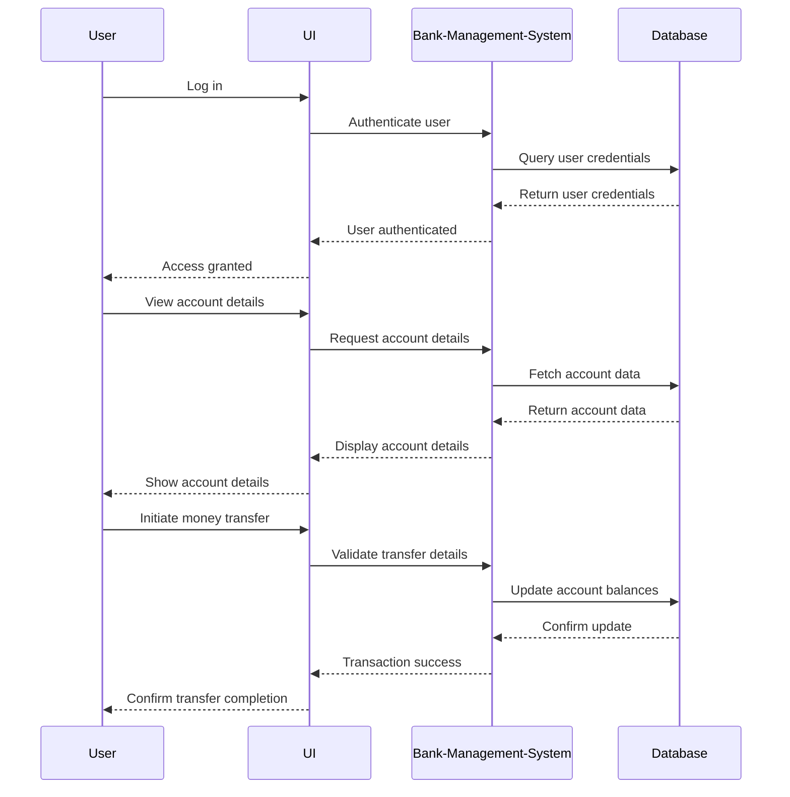

# Bank Management System

> A comprehensive Java-based solution for managing banking operations with ease.

 

## Overview

The Bank Management System is a robust application designed to handle various banking operations such as account management, customer details, and money transfers. Built with Java, this system aims to streamline banking processes, ensuring efficiency and accuracy in handling customer data and transactions. 

## Architecture & Workflow

The system is structured around a modular architecture that separates concerns into distinct components, each responsible for specific functionalities like user authentication, account management, and transaction processing.



## Granular Tech Stack

- **Languages**: Java
- **Frameworks**: None (Core Java)
- **Libraries**: MySQL Connector/J
- **Tools**: Apache Ant, NetBeans IDE

## Key Features

- User authentication and authorization
- Account creation and management
- Detailed customer information management
- Money transfer between accounts
- Secure password update functionality

## Project Structure

```
Bank-Management-System/
├── BankManagementSystem-master.iml
├── bank2.sql
├── finalBank/
│   ├── build.xml
│   ├── manifest.mf
│   ├── nbproject/
│   ├── src/
│   │   └── Bank1/
│   │       ├── AccountDetails.java
│   │       ├── AccountShow.java
│   │       ├── CustomerDetails.java
│   │       ├── DetailsInfo.java
│   │       ├── LoginPage.java
│   │       ├── MoneyTransfer1.java
│   │       ├── Registration.java
│   │       ├── UpdatePass.java
│   │       └── WelcomePage.java
└── out/
    └── production/
        └── BankManagementSystem-master/
```

## Getting Started

### Prerequisites

- Java Development Kit (JDK) 8 or higher
- MySQL Database
- Apache Ant
- NetBeans IDE (optional)

### Installation

1. **Clone the repository**

   ```bash
   git clone https://github.com/yourusername/bank-management.git
   ```

2. **Navigate to the project directory**

   ```bash
   cd bank-management/BankManagementSystem-master/finalBank
   ```

3. **Compile the project using Apache Ant**

   ```bash
   ant compile
   ```

### Running the Project

1. **Set up the database**

   Import the `bank2.sql` file into your MySQL database.

2. **Run the project**

   ```bash
   ant run
   ```

## Usage

- **Log in** using your credentials on the login page.
- **View and manage account details** from the dashboard.
- **Transfer money** between accounts using the money transfer feature.
- **Update your password** securely through the update password option.

## Roadmap

- Implement a RESTful API for external integrations.
- Add support for multiple currencies.
- Introduce a mobile application interface.
- Enhance security with two-factor authentication.

## Contributing

Contributions are welcome! Please fork the repository and submit a pull request for review.

## License

This project is licensed under the MIT License. See the [LICENSE](LICENSE) file for details.
